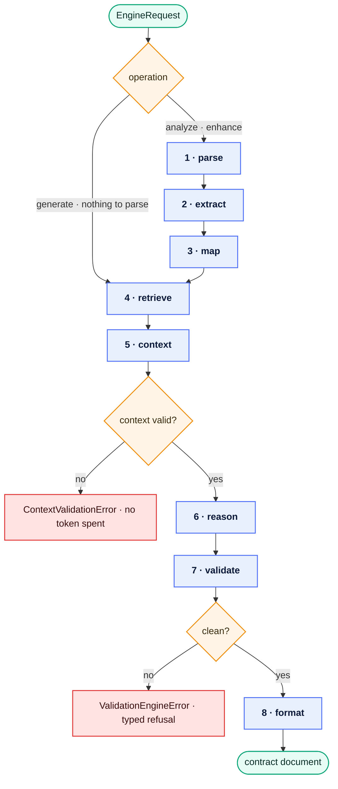
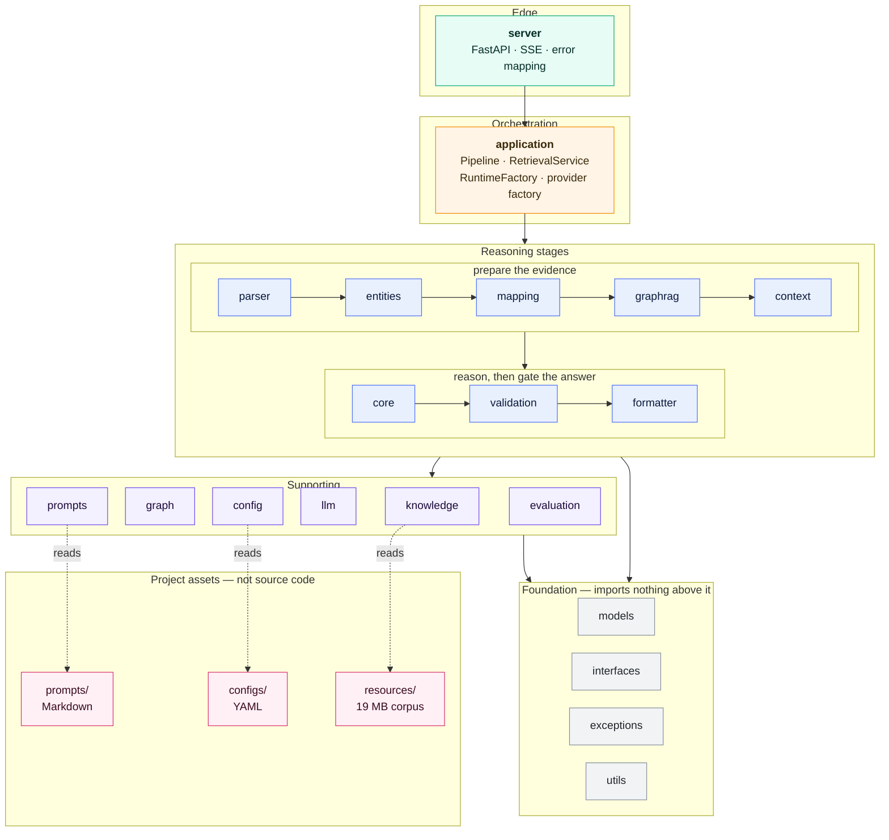
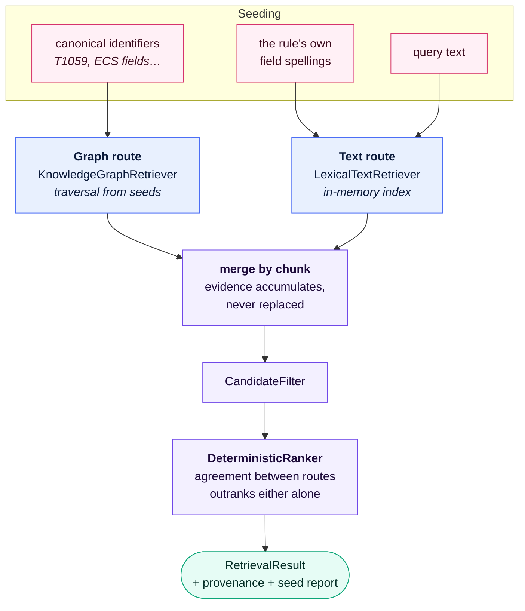
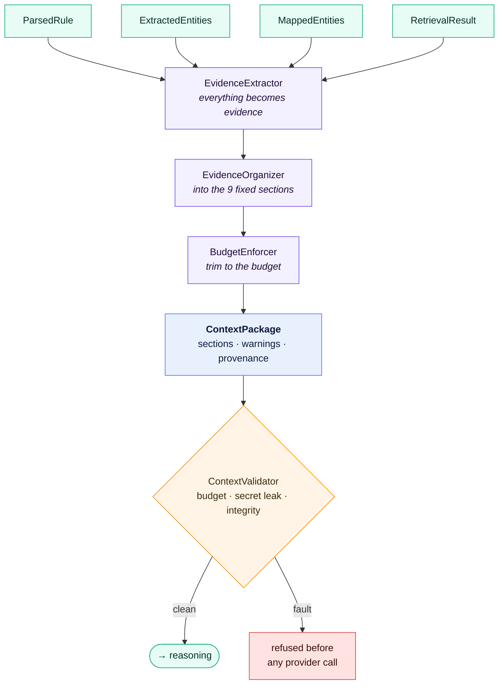
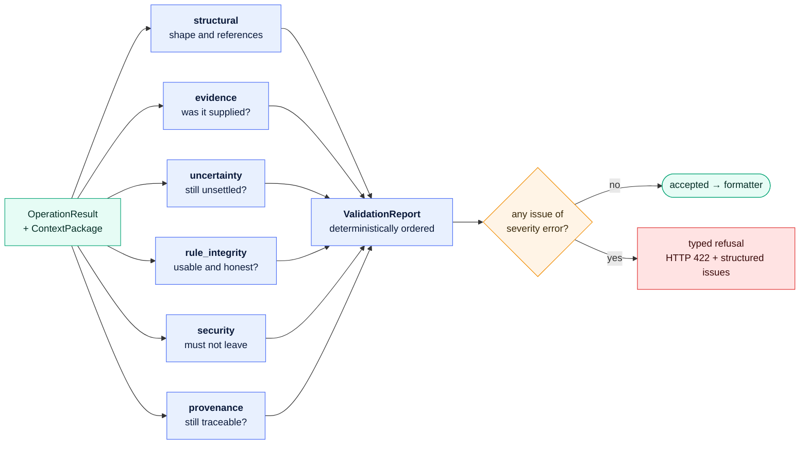
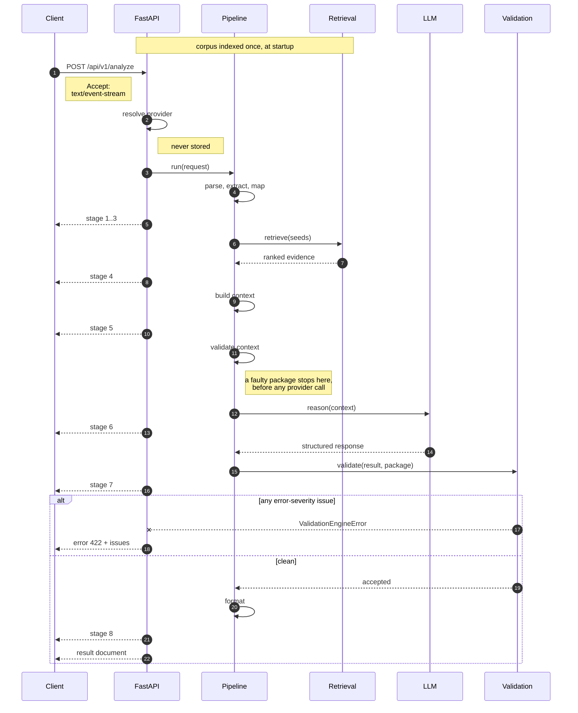
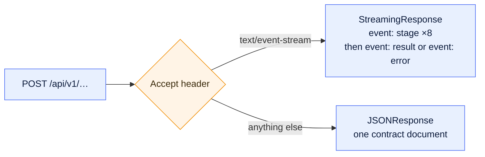
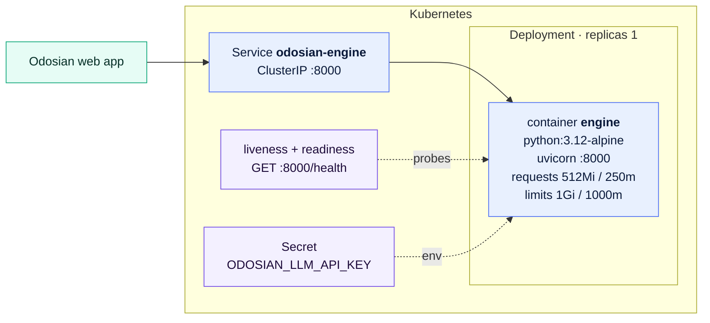

<div align="center">

# ODOSIAN AI Engine

**An AI reasoning engine for detection engineering.**

It reads an Elastic or Sigma detection rule, grounds it in a curated security corpus, and drives
a language model to **analyze**, **enhance**, or **generate** — refusing any answer it cannot
trace back to the evidence it supplied.


[Operations](#the-three-operations) ·
[Pipeline](#1--the-pipeline-one-path-three-shapes) ·
[Layers](#2--layers-and-dependency-direction) ·
[GraphRAG](#3--retrieval-two-routes-one-ranked-set) ·
[Context](#4--the-context-package) ·
[Validation](#5--the-validation-gate-six-categories) ·
[API](#http-api) ·
[Getting started](#getting-started)

</div>

---

## What this is

A **reasoning component**, and only that. The web application, user management, the Elastic Stack
itself, and the surrounding infrastructure are outside its scope. It is handed a rule or a
requirement, and it returns a contract document.

Three properties hold on every run:

| Property | What it means in practice |
| --- | --- |
| **Grounded** | Every claim the model makes must cite an item the engine itself placed in the context package. Uncited claims are refused, not trimmed. |
| **Deterministic where it can be** | Parsing, extraction, mapping, retrieval, ranking, and context assembly carry no randomness and no timestamps. The same input produces the same package. |
| **Fail-loud** | No stage catches, wraps, or retries another's errors. A rule that will not parse surfaces as a parser error; a result the validation engine rejects surfaces as that rejection. |

---

## The three operations

| Operation | Subject | Path through the pipeline | Returns |
| --- | --- | --- | --- |
| **analyze** | a rule document, **or** a bare query plus its language | all 8 stages | an analysis of what the rule detects, and where it falls short |
| **enhance** | a rule document that states a query | all 8 stages | the original query beside a rewrite, with reasoning for each change |
| **generate** | a requirement in natural language | short path — nothing to parse, extract, or map | a new rule built from retrieved evidence |

> [!NOTE]
> **`enhance` needs a rule that states a single query expression.** Sigma keeps its detection in
> named blocks with a separate condition, so it has no query to rewrite — and the engine performs
> no translation between rule formats. Such a request is refused **before retrieval runs and
> before a provider is paid**. `analyze` reads the same rule perfectly well.

---

## Architecture

Six views of the same engine, from the outside in.

### 1 · The pipeline: one path, three shapes

`analyze`, `enhance`, and `generate` are three paths through **one** pipeline, not three
pipelines. The first two differ only in which engine method runs at the end; `generate` branches
earlier and takes a shorter route, because a requirement has no rule to parse.



Two things in that diagram are deliberate rather than incidental:

- **The context is validated before the provider is.** A package that fails its own validator
  would otherwise be paid for and *then* refused. Validating first means a caller never spends a
  token on evidence the engine would not have accepted.
- **`generate` enters at stage 4.** The parser, extractor, and mapper are never called — there is
  no rule, and a requirement is not one.

Each stage emits a progress event, which is what the SSE endpoints stream:

| # | Stage | Component | Label sent to the client |
| --- | --- | --- | --- |
| 1 | `parse` | `RuleParser` | Parsing rule structure |
| 2 | `extract` | `EntityExtractor` | Extracting entities |
| 3 | `map` | `EntityMapper` | Mapping to knowledge domains |
| 4 | `retrieve` | `RetrievalService` → GraphRAG | Retrieving evidence from knowledge base |
| 5 | `context` | `ContextBuilder` + `ContextValidator` | Building grounded context |
| 6 | `reason` | `ReasoningEngine` → `LLMProvider` | AI reasoning with evidence |
| 7 | `validate` | `ValidationEngine` | Validating claims against evidence |
| 8 | `format` | `format_result` | Formatting results |

### 2 · Layers and dependency direction

Modules communicate only through the abstractions in `src/interfaces/`. No module imports another
module's implementation, which keeps the dependency graph acyclic. Arrows point in the direction
a layer is allowed to depend.



Prompts, configuration, and knowledge datasets live **outside `src/`** on purpose. They are assets
that change on their own schedule, and treating them as code would turn every corpus refresh into
a code change.

### 3 · Retrieval: two routes, one ranked set

Retrieval is hybrid. A lexical index and a graph traversal run over the same corpus, and their
results are **merged by chunk** — accumulating evidence rather than replacing it. A chunk found by
both routes ends up carrying both pieces of evidence, which is exactly what lets the ranker treat
agreement between routes as stronger than either route alone.



> [!IMPORTANT]
> **A rule's fields go out in two vocabularies, one per route.** The graph is keyed by what the
> *corpus* calls a field; the text index holds what *rules* wrote — and for Sigma those are not the
> same string. The corpus spells one field `CommandLine` in 1,366 of its own records and
> `process.command_line` in none. Asking both routes in a single vocabulary would mean asking one
> of them in a vocabulary it cannot answer in, so each route is seeded in its own. Neither name is
> derived from the other, and neither replaces the other.

Deduplication is careful about what a duplicate is: two chunks of one record are different items,
two rules pointing at one technique are different items, and only the same chunk arriving twice is
one item — even then its evidence entries are kept separate.

The corpus is five approved datasets, loaded once at startup and held in memory for the process
lifetime:

| Source | Holds |
| --- | --- |
| `mitre` | ATT&CK techniques, tactics, groups, software |
| `sigma` | Community Sigma detection rules |
| `elastic` | Elastic prebuilt detection rules |
| `lolbas` | LOLBAS / GTFOBins living-off-the-land binaries |
| `ecs` | Elastic Common Schema field definitions |

No database is on this path. Neo4j remains an **optional** persistence backend; the graph used for
retrieval is built in-process.

### 4 · The context package

The builder converts every input into evidence, organises it into sections in a **fixed order**,
applies the budget, then attaches the warnings and provenance produced along the way. It performs
no retrieval, opens no file, renders no prompt, and calls no model.



A section that gathered no items is omitted, but the ones present always appear in this order:

| # | Section | Carries |
| --- | --- | --- |
| 1 | `rule` | the rule under discussion, as parsed |
| 2 | `entities` | what the extractors found in it |
| 3 | `mappings` | the canonical identifiers those entities resolved to |
| 4 | `retrieval` | retrieved items the traversal did **not** reach — lexical evidence |
| 5 | `graph` | retrieved items traversal **did** reach; the path is what justifies them |
| 6 | `knowledge` | supporting records drawn from the five datasets |
| 7 | `references` | only the references the caller's own rule states |
| 8 | `warnings` | what could not be resolved, stated rather than hidden |
| 9 | `metadata` | the package's own provenance |

Nothing is deduplicated anywhere in here. Two items with identical text can be two rules citing one
technique, or two chunks of one record — distinct evidence in both cases, and collapsing them would
destroy the plurality that makes the package auditable.

Everything the builder emits is reproducible from its inputs: no timestamps, no identifiers derived
from object addresses, and no ordering that depends on dictionary insertion beyond the fixed
section order.

### 5 · The validation gate: six categories

The boundary a reasoning result crosses before an application may act on it. The engine runs
**every** check and collects everything rather than stopping at the first fault — a caller fixing a
prompt wants the whole list, not one item at a time.



Issue codes are namespaced by category, so a refusal says precisely what went wrong:

| Category | The question it asks | Representative codes |
| --- | --- | --- |
| `structural` | Is the result's own shape sound — fields, types, ranges, internal references? | `missing_value`, `invalid_enum`, `out_of_range`, `duplicate_id`, `unknown_reference`, `impossible_combination` |
| `evidence` | Did the context package actually supply what the result cites? | `unknown_item`, `fabricated_identifier`, `fabricated_name`, `unsupported_claim`, `empty_citation` |
| `uncertainty` | Did unsettled identifiers survive reasoning unchanged, or were they quietly resolved? | `dropped`, `status_promoted`, `ambiguity_narrowed`, `fabricated_candidate`, `presented_as_fact`, `unsettled_identifier_in_rule` |
| `rule_integrity` | Is a produced or preserved rule usable and honest? | `original_altered`, `unchanged`, `no_changes_accounted`, `no_rationale`, `incomplete_rule`, `language_type_mismatch`, `fabricated_mapping` |
| `security` | Is anything in here that must never leave the engine? | `credential_in_result`, `template_artifact`, `fence_artifact`, `fabricated_reference` |
| `provenance` | Does each citation still trace back to the material it names? | `source_mismatch`, `not_traceable`, `status_not_preserved` |

The engine **never repairs** a result, never fills a missing value, never drops an issue it cannot
explain, and never mutates either input. It also opens no file, reads no dataset, holds no
credential, and makes no network call — everything it needs is in the two objects it is handed.
That is what lets it judge a result nothing else examined: one restored from a cache, assembled by
an application, or replayed from a log.

### 6 · A request, end to end



Provider credentials arrive **per request** from the web app's settings and are never persisted by
the engine. The pipeline itself never learns which backend sits behind the provider it holds —
which is what lets the entire test suite run without a credential.

Logging follows one rule at every layer: the operation, the provider, the model, and the shape of
the run. Never a rule, never a requirement, never context, never a response, never a credential,
and never the account that asked.

---

## HTTP API

| Method | Path | Body | Notes |
| --- | --- | --- | --- |
| `GET` | `/health` | — | `{"status": "ok", "pipeline_ready": true}` |
| `POST` | `/api/v1/analyze` | `user_id`, `rule_text` **or** `query` + `language`, `provider` | |
| `POST` | `/api/v1/enhance` | `user_id`, `rule_text`, `provider` | needs a rule stating a query |
| `POST` | `/api/v1/generate` | `user_id`, `requirement`, `provider` | |

Every operation endpoint answers in **two modes** from the same route:



<details>
<summary><b>Example — analyze a bare query, streaming</b></summary>

```bash
curl -N -X POST http://localhost:8000/api/v1/analyze \
  -H 'Content-Type: application/json' \
  -H 'Accept: text/event-stream' \
  -d @request.json
```

`request.json`:

```json
{
  "user_id": "analyst-1",
  "query": "process where process.name == \"powershell.exe\" and process.args : \"*-enc*\"",
  "language": "eql",
  "provider": {
    "base_url": "https://generativelanguage.googleapis.com",
    "api_key": "…",
    "model": "gemini-2.5-pro"
  }
}
```

</details>

<details>
<summary><b>Status codes — every engine error has one</b></summary>

| Status | Category | Raised when |
| --- | --- | --- |
| `400` | `invalid_request` | the request cannot be run as stated — e.g. `enhance` on a rule with no query |
| `401` | `auth` | the provider rejected the credential |
| `422` | *the failing validation category* | the result failed the validation gate; the body carries `structured_issues` |
| `422` | `reasoning_validation` | the model's response did not satisfy the response schema |
| `429` | `rate_limit` | the provider rate-limited the request |
| `500` | `context_error` · `context_validation` | the context package exceeded its budget, leaked a secret, or failed its validator |
| `500` | `prompt_error` · `internal` | a prompt failed to render, or an unhandled fault |
| `502` | `provider_error` | the provider failed in a way with no more specific mapping |
| `503` | `provider_unavailable` | the provider is unreachable, down, or the model is unavailable |
| `504` | `timeout` | the provider did not answer in time |

A validation refusal carries the full issue list:

```json
{
  "error": "the result cites evidence the context package did not supply",
  "category": "evidence",
  "issues": ["…"],
  "structured_issues": [
    {
      "code": "evidence.unknown_item",
      "severity": "error",
      "category": "evidence",
      "path": "findings[2].citations[0]",
      "message": "…"
    }
  ]
}
```

</details>

---

## Repository layout

| Package | Responsibility |
| --- | --- |
| `server` | FastAPI application: routes, SSE streaming, exception-to-HTTP mapping. |
| `application` | Orchestration: the pipeline, retrieval assembly, provider factory, run envelope. |
| `core` | The reasoning engine: prompt-driven operations, response parsing, uncertainty ledger. |
| `config` | Centralised loading of YAML configuration and credentials. |
| `parser` | Reads Elastic and Sigma rule documents; recognises KQL/kuery, EQL, ES\|QL, Lucene, and Sigma detection languages. |
| `entities` | Extracts processes, files, registry keys, ports, IPs, commands, ECS fields, identities. |
| `mapping` | Resolves entities to canonical identifiers against MITRE ATT&CK, ECS, and the ontology. |
| `knowledge` | Loads, normalises, resolves, and queries the five knowledge datasets. |
| `graph` | Knowledge graph construction and traversal, with optional Neo4j persistence. |
| `graphrag` | Hybrid retrieval: lexical index, graph traversal, deterministic ranking, provenance. |
| `context` | Assembles and validates the context package the model consumes. |
| `prompts` | Loads, versions, and renders the prompt assets stored under `prompts/`. |
| `llm` | Provider-agnostic abstraction over Gemini, OpenAI, and Anthropic backends. |
| `validation` | The six-category gate a result crosses before an application may act on it. |
| `formatter` | Renders an accepted result into the contract document of its operation. |
| `evaluation` | Benchmarks, ablations, ground truth, and metrics for the engine's own output. |
| `models` · `interfaces` | Shared domain models, and the abstract contracts between modules. |
| `exceptions` · `utils` | Project exceptions and reusable helpers. |

<details>
<summary><b>Full directory tree</b></summary>

```
odosian-ai-engine/
├── configs/                      # YAML configuration
│   ├── engine.yaml  model.yaml  logging.yaml  security.yaml
│   └── logging/  models/  providers/  settings/
├── docs/
│   ├── stage-00/                 # vision, architecture, standards, glossary
│   ├── Stage-01_Domain_Model/    # models, data & interface contracts, error model
│   ├── Stage-02/                 # architecture, components, design patterns
│   ├── Stage-03_Knowledge Layer/ # knowledge graph, GraphRAG
│   ├── LLM_Contract_v1.0.md  Prompt_Specification_v1.0.md
│   └── api/  architecture/  decisions/
├── Odosian AI Schemas/           # JSONC request/response contracts shared with the web app
├── evaluation/results/           # recorded evaluation runs
├── examples/                     # example inputs and expected outputs
├── k8s/                          # deployment.yaml, service.yaml
├── prompts/                      # prompt assets (Markdown)
│   └── analyze/  enhance/  generate/  shared/  templates/
├── resources/                    # immutable, read-only inputs
│   ├── knowledge/                # mitre/ sigma/ elastic/ lolbas/ ecs/ atomic/
│   ├── mappings/
│   └── schemas/
├── scripts/                      # dataset updates, index and graph rebuilds
├── src/
│   ├── server/                   # FastAPI app, request/response schemas
│   ├── application/              # pipeline, retrieval, runtime, provider factory
│   ├── core/                     # reasoning engine, response parsing, uncertainty
│   ├── config/  parser/  entities/  mapping/
│   ├── knowledge/                # loader/ repository/ normalizer/ resolver/ models/ interfaces/
│   ├── graph/  graphrag/  context/  prompts/  llm/
│   ├── validation/  formatter/  evaluation/
│   └── models/  interfaces/  exceptions/  utils/
├── tests/
│   └── unit/  integration/  evaluation/  performance/  fixtures/
├── Dockerfile  docker-compose.yml  README_DOCKER.md
├── pyproject.toml  requirements.txt
└── .env.example  LICENSE  README.md
```

</details>

---

## Getting started

**Prerequisites** — Python 3.12 or newer, and an API key for the configured language model provider.

```bash
python -m venv .venv
```

```bash
pip install -e ".[dev]"
```

```bash
cp .env.example .env
```

Run the service:

```bash
uvicorn src.server.app:app --host 0.0.0.0 --port 8000
```

The pipeline builds once at startup — indexing the corpus takes a few seconds — and `/health`
reports `pipeline_ready: false` until it is done.

### Quality gates

```bash
ruff check . && mypy && pytest
```

PEP 8, full type hints, `ruff` for linting, `mypy --strict` for type checking, and `pytest` for the
suite. `ruff` runs with `E, F, I, N, UP, ANN, B, D` selected at a 100-column limit.

---

## Deployment



The image is Alpine-based and ships the corpus, prompts, and configuration inside it. See
**[README_DOCKER.md](README_DOCKER.md)** for the Docker and Compose workflow, and `k8s/` for the
manifests.

---

<div align="center">

MIT © ODOSIAN

</div>
