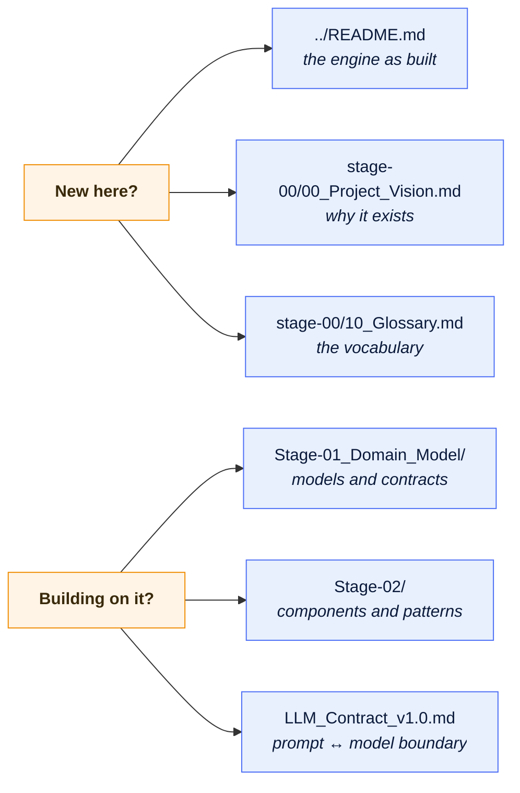

# Documentation

Design documentation for the ODOSIAN AI Engine, written stage by stage as the engine was
specified. Start here to find the right page.

> [!IMPORTANT]
> **These are design documents, not a description of the running code.** They record what was
> specified at each stage, and several of them predate the implementation. The flow in `stage-00`,
> for instance, lists knowledge base, knowledge graph, and GraphRAG as three sequential
> components; the engine ships them collapsed into a single `retrieve` stage.
>
> For what the engine actually does today, read the **[project README](../README.md)**.

---

## Where to start

---

## Approved contracts

The two documents below are **approved**, not drafts, and the code is written against them.

| Document | Defines |
| --- | --- |
| [LLM_Contract_v1.0.md](LLM_Contract_v1.0.md) | The contract between the prompt-management layer and the language model: what is sent, what must come back, and what is rejected. |
| [Prompt_Specification_v1.0.md](Prompt_Specification_v1.0.md) | The official prompt architecture — how the assets under `prompts/` are structured, versioned, and rendered. |

---

## Stage 00 · Foundations

Vision, standards, and the vocabulary the rest of the documentation assumes.

| Document | Covers |
| --- | --- |
| [00_Project_Vision.md](stage-00/00_Project_Vision.md) | What the engine is for, and what it deliberately is not. |
| [01_AI_Architecture.md](stage-00/01_AI_Architecture.md) | The layered architecture and the rules governing how layers talk. |
| [02_Data_Flow.md](stage-00/02_Data_Flow.md) | How a request moves from raw input to a validated response, step by step. |
| [03_Project_Structure.md](stage-00/03_Project_Structure.md) | Where every kind of file belongs, and why assets sit outside `src/`. |
| [04_Module_Responsibilities.md](stage-00/04_Module_Responsibilities.md) | One responsibility per module, stated explicitly. |
| [05_Workflow.md](stage-00/05_Workflow.md) | The development workflow the stages follow. |
| [06_Prompt_Standard.md](stage-00/06_Prompt_Standard.md) | How prompts are written, reviewed, and versioned. |
| [07_Coding_Standard.md](stage-00/07_Coding_Standard.md) | Style, typing, and the quality gates. |
| [08_Definition_of_Done.md](stage-00/08_Definition_of_Done.md) | What "finished" means for a stage. |
| [09_Review_Checklist.md](stage-00/09_Review_Checklist.md) | What a reviewer checks before accepting work. |
| [10_Glossary.md](stage-00/10_Glossary.md) | The project vocabulary. Read this first if a term is unfamiliar. |

---

## Stage 01 · Domain model

The conceptual foundation: the entities the engine reasons about, and the contracts that carry
them between modules.

| Document | Covers |
| --- | --- |
| [00_Domain_Model.md](Stage-01_Domain_Model/00_Domain_Model.md) | The primary domain entities and their relationships. |
| [01_Core_Models.md](Stage-01_Domain_Model/01_Core_Models.md) | The models every module exchanges. |
| [02_Model_Specifications.md](Stage-01_Domain_Model/02_Model_Specifications.md) | Field-by-field specification of each model. |
| [03_Data_Contracts.md](Stage-01_Domain_Model/03_Data_Contracts.md) | What each stage receives and what it must produce. |
| [04_Interface_Contracts.md](Stage-01_Domain_Model/04_Interface_Contracts.md) | The abstract interfaces modules depend on instead of each other. |
| [05_Error_Model.md](Stage-01_Domain_Model/05_Error_Model.md) | The exception hierarchy and what each error means. |
| [06_Configuration_Model.md](Stage-01_Domain_Model/06_Configuration_Model.md) | How configuration is shaped, loaded, and validated. |

---

## Stage 02 · Architecture

| Document | Covers |
| --- | --- |
| [00_Architecture.md](Stage-02/00_Architecture.md) | The architectural blueprint: layers, execution flow, boundaries. |
| [01_Components.md](Stage-02/01_Components.md) | Each component, its inputs, outputs, and neighbours. |
| [02_Design_Patterns.md](Stage-02/02_Design_Patterns.md) | The patterns used, and the reason each was chosen. |

---

## Stage 03 · Knowledge layer

| Document | Covers |
| --- | --- |
| [01_Knowledge_Graph.md](Stage-03_Knowledge%20Layer/01_Knowledge_Graph.md) | Turning isolated records into a connected semantic network. |
| [02_GraphRAG.md](Stage-03_Knowledge%20Layer/02_GraphRAG.md) | Graph-aware retrieval: how evidence is selected and ranked. |

---

## Pending

| Document | Status |
| --- | --- |
| [Documentation_Sync_v1.1.md](Documentation_Sync_v1.1.md) | **Deferred.** Records documentation changes agreed during implementation but deliberately not yet applied, so the decisions are not lost. |

`api/`, `architecture/`, and `decisions/` are placeholders. Nothing has been filed in them yet.

---

## Related material outside this folder

| Location | Holds |
| --- | --- |
| [../README.md](../README.md) | The engine as built: pipeline, retrieval, validation, HTTP API, deployment. |
| [../README_DOCKER.md](../README_DOCKER.md) | Building and running the container, in Arabic and English. |
| [`../Odosian AI Schemas/`](../Odosian%20AI%20Schemas/) | The JSONC request and response contracts shared with the Odosian web application. |
| `../prompts/` | The prompt assets themselves, as Markdown. |
