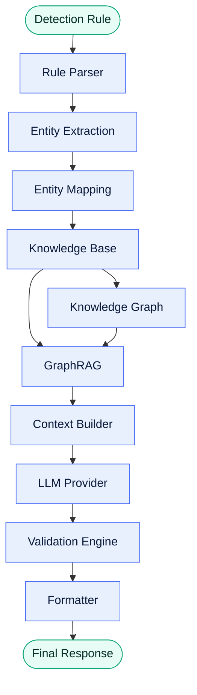
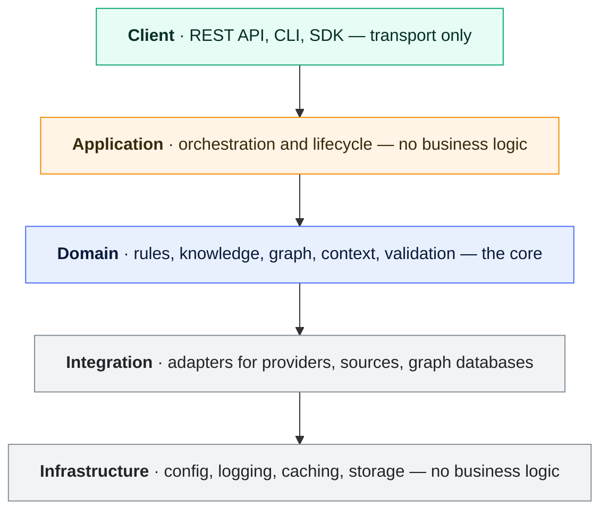

# Architecture

**Version:** 1.0 · **Status:** Draft · **Stage:** 02 — Architecture

> [!NOTE]
> A design-stage document. For the architecture as built, including the HTTP service and
> the eight-stage pipeline, see the [project README](../../README.md).

---

## Purpose

This document defines the high-level architecture of the ODOSIAN AI Engine.

It describes the major architectural layers, core components, execution flow, design principles, and system boundaries. The goal is to provide a complete architectural blueprint while remaining independent of implementation details.

This document serves as the primary architectural reference for developers, reviewers, and contributors.

---

## Scope

This document defines:

- System architecture
- Architectural layers
- Major components
- Component responsibilities
- Execution pipeline
- Dependency rules
- Cross-cutting concerns
- Performance considerations
- Security considerations
- Extensibility principles

This document does not define:

- Implementation details
- Programming language constructs
- Infrastructure deployment
- API specifications

---

## Architectural Principles

The ODOSIAN AI Engine follows these principles:

- Separation of Concerns
- Single Responsibility
- High Cohesion
- Loose Coupling
- Dependency Inversion
- Immutable Data Flow
- Composition over Inheritance
- Explicit Interfaces
- Replaceable Components

---

## System Overview

The AI Engine transforms a cybersecurity detection rule into an AI-generated explanation through a deterministic processing pipeline.

---

## Architectural Layers

Dependencies flow downward only. A layer never reaches back up, and the domain layer never
touches infrastructure directly.

### Client Layer

Handles incoming requests from external clients.

Examples:

- REST API
- CLI
- SDK
- Future integrations

Responsibilities:

- Receive requests
- Validate transport-level requirements
- Return responses

---

### Application Layer

Coordinates the execution of the processing pipeline.

Responsibilities:

- Workflow orchestration
- Module coordination
- Error propagation
- Lifecycle management

The Application Layer contains no business logic.

---

### Domain Layer

Contains the core intelligence of the system.

Responsibilities:

- Rule analysis
- Entity analysis
- Knowledge retrieval
- Graph reasoning
- Context construction
- Validation

The Domain Layer is independent of infrastructure and external providers.

---

### Integration Layer

Provides adapters for external systems.

Examples:

- LLM providers
- External knowledge sources
- Graph databases

Responsibilities:

- Translate external APIs
- Normalize provider responses
- Isolate third-party dependencies

---

### Infrastructure Layer

Provides technical capabilities.

Examples:

- Configuration
- Logging
- Caching
- Storage
- Networking

No business logic belongs here.

---

## Core Components

| Component | Responsibility |
|-----------|----------------|
| Rule Parser | Parse and normalize detection rules |
| Entity Extraction | Identify cybersecurity entities |
| Entity Mapping | Resolve aliases and canonical identifiers |
| Knowledge Base | Retrieve trusted knowledge |
| Knowledge Graph | Expand semantic relationships |
| GraphRAG | Retrieve ranked contextual evidence |
| Context Builder | Assemble LLM context |
| LLM Provider | Generate AI output |
| Validation Engine | Validate AI response |
| Formatter | Produce final response |

---

## Execution Pipeline

The processing workflow is strictly sequential.

1. Receive Detection Rule
2. Parse Rule
3. Extract Entities
4. Normalize Entities
5. Retrieve Knowledge
6. Expand Graph Context
7. Rank Context using GraphRAG
8. Build LLM Context
9. Generate AI Response
10. Validate Response
11. Format Final Output

---

## Dependency Rules

The architecture follows these dependency rules:

- Components depend on interfaces.
- Components never depend on concrete implementations.
- Domain components do not access infrastructure directly.
- External providers are accessed only through adapters.
- Dependencies must flow in one direction.

---

## Cross-Cutting Concerns

The following concerns apply across all components:

- Configuration
- Logging
- Error Handling
- Metrics
- Security
- Tracing

These concerns remain isolated from business logic.

---

## Performance Considerations

The architecture is designed to support:

- Caching
- Parallel knowledge retrieval
- Efficient graph traversal
- Incremental loading
- Lazy initialization

Performance optimizations must not alter business behavior.

---

## Security Considerations

The architecture enforces:

- Input validation
- Output validation
- Secret isolation
- Least privilege
- Provider isolation

Sensitive information must never be exposed outside authorized boundaries.

---

## Extensibility

The architecture supports future extension through:

- New rule parsers
- Additional LLM providers
- New knowledge sources
- Alternative graph engines
- Additional validation strategies
- Plugin-based components

No existing component should require modification when adding a new provider.

---

## Architectural Constraints

The system must:

- Remain deterministic where possible.
- Preserve traceability.
- Support reproducible processing.
- Keep business logic independent of infrastructure.
- Allow component replacement without affecting consumers.

---

## Future Evolution

The architecture is prepared for:

- Multi-agent workflows
- Distributed execution
- Microservices
- Event-driven pipelines
- Cloud-native deployment

---

End of Document