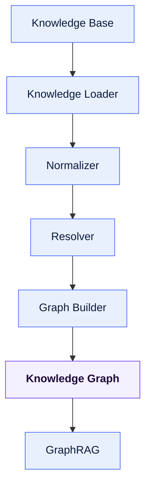
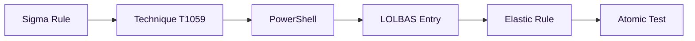
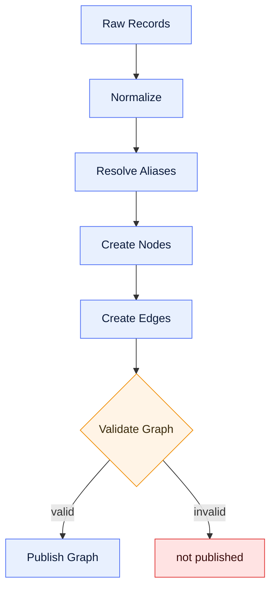
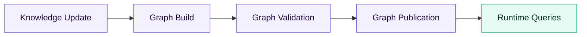
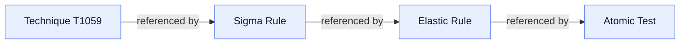
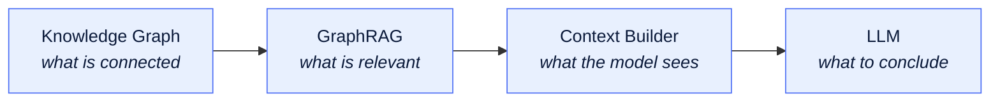

# Knowledge Graph

**Version:** 1.0 · **Status:** Draft · **Stage:** 03 — Knowledge Layer

> [!NOTE]
> A design-stage document. In the shipped engine the graph is built in-process from the
> JSONL corpus and queried through hybrid retrieval — see the
> [project README](../../README.md).

---

## Purpose

This document defines the architecture of the Knowledge Graph used by the ODOSIAN AI Engine.

The Knowledge Graph transforms isolated cybersecurity records into a connected semantic network that enables contextual reasoning, relationship discovery, GraphRAG retrieval, and explainable AI responses.

The Knowledge Graph is not a replacement for the Knowledge Base.

Instead, it is an additional semantic layer built from the Knowledge Base.

---

## Scope

This document defines:

- Knowledge Graph architecture
- Node model
- Edge model
- Graph construction
- Graph lifecycle
- Relationship management
- Graph boundaries

This document does NOT define:

- Graph database technology
- Graph query language
- Graph implementation
- Graph storage engine

---

## Design Principles

The Knowledge Graph should be:

- Source-aware
- Explainable
- Traceable
- Immutable during runtime
- Provider-independent
- Extensible

Every relationship must be explainable.

---

## Knowledge Graph Overview

---

## Purpose of the Graph

The Knowledge Base answers:

> What information exists?

The Knowledge Graph answers:

> How is this information related?

Example:

The graph enables navigation between related concepts.

---

## Node Types

The graph consists of semantic nodes.

Current node categories include:

- Technique
- Tactic
- Sigma Rule
- Elastic Rule
- Atomic Test
- LOLBAS Entry
- Software
- Threat Group
- Campaign
- Mitigation
- Data Source

Additional node types may be introduced in future versions.

---

## Edge Types

Edges represent semantic relationships.

Examples include:

- uses
- detects
- references
- belongs_to
- mitigates
- tests
- related_to
- parent_of
- child_of

Edges represent knowledge relationships, not execution flow.

---

## Node Identity

Every node must have:

- Stable identifier
- Canonical identifier
- Source reference
- Source type

Original identifiers must always remain recoverable.

---

## Edge Identity

Every edge should define:

- Source node
- Target node
- Relationship type
- Relationship origin

Relationships should preserve provenance.

---

## Graph Construction

Graph construction consists of multiple stages.

The graph is built offline.

Runtime requests must never rebuild the graph.

---

## Relationship Sources

Relationships may originate from:

- MITRE ATT&CK
- Sigma references
- Elastic mappings
- LOLBAS references
- Atomic mappings

Relationships should never be invented by the graph builder.

---

## Missing Relationships

The Knowledge Graph must distinguish between four states that are **not** equivalent:

| State | Means |
| --- | --- |
| **Known** | The relationship is recorded by a source. |
| **Unknown** | No source states it either way. *Unknown does not imply false.* |
| **Missing** | A source that should state it does not. *Missing does not imply absence.* |
| **Inferred** | Derived rather than recorded, and marked as such. |

---

## Version Handling

Different knowledge sources may reference different ATT&CK versions.

The graph should normalize identifiers before creating edges.

Canonical identifiers should be used internally.

Original identifiers should remain available for traceability.

---

## Graph Validation

Before publication, the graph should verify:

- Duplicate nodes
- Duplicate edges
- Invalid identifiers
- Broken references
- Cyclic validation rules (where applicable)

Invalid graph structures must not be published.

---

## Graph Lifecycle

Graph construction and runtime querying are separate processes.

---

## Runtime Responsibilities

During runtime, the graph should provide:

- Neighbor discovery
- Relationship traversal
- Context expansion
- Evidence collection

The graph should not perform AI reasoning.

---

## Explainability

Every retrieved relationship should remain explainable.

Example:

The graph must preserve the chain of evidence.

---

## Graph Independence

The Knowledge Graph must remain independent from:

- LLM provider
- Prompt templates
- Validation logic
- Response formatting

Its responsibility ends with semantic relationship retrieval.

---

## Future Expansion

The architecture supports future additions including:

- Organization-specific knowledge
- Threat Intelligence feeds
- Vulnerability relationships
- Malware relationships
- Asset relationships
- Detection coverage analysis

New relationship types should extend the graph without modifying existing node definitions.

---

## Knowledge Graph Boundary

The graph answers:

> "What is connected?"

It does NOT answer:

> "What should the AI conclude?"

Reasoning belongs to later stages:

---

End of Document