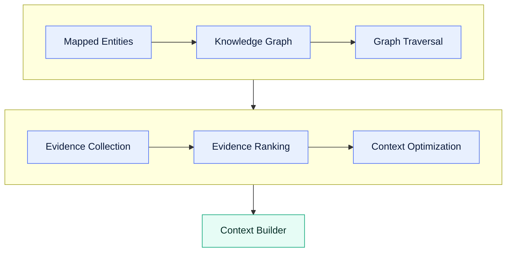
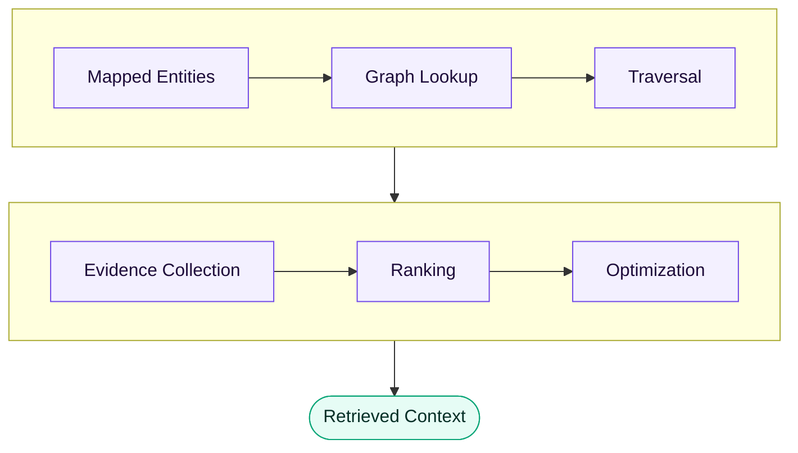

# GraphRAG

**Version:** 1.0 · **Status:** Draft · **Stage:** 03 — Knowledge Layer

> [!NOTE]
> A design-stage document. The shipped retriever is hybrid — a lexical index and graph
> traversal merged by chunk and ranked deterministically. See the
> [project README](../../README.md).

---

## Purpose

This document defines the Graph Retrieval-Augmented Generation (GraphRAG) architecture used by the ODOSIAN AI Engine.

GraphRAG is responsible for retrieving the most relevant cybersecurity knowledge from the Knowledge Graph and preparing high-quality evidence for the AI reasoning process.

GraphRAG is not responsible for AI reasoning.

Its only responsibility is selecting the best evidence.

---

## Scope

This document defines:

- Retrieval pipeline
- Graph traversal
- Evidence selection
- Ranking
- Context optimization
- Retrieval boundaries

It does NOT define:

- Prompt engineering
- AI reasoning
- LLM providers
- Validation

---

## Philosophy

GraphRAG answers one question:

> "What information should the AI see?"

It never answers:

> "What should the AI conclude?"

Reasoning belongs to the LLM.

---

## High-Level Pipeline

---

## Step 1 — Starting Point

GraphRAG receives:

- Canonical entities
- Parsed rule
- Request type

Example:

| Input | Example value |
| --- | --- |
| Technique | `T1059` |
| Process | `powershell.exe` |
| Command | `Invoke-WebRequest` |

---

## Step 2 — Graph Traversal

GraphRAG searches the graph.

Traversal may discover:

- Related techniques
- Parent tactics
- Detection rules
- Atomic tests
- LOLBAS entries
- Threat groups
- Software

Traversal should remain bounded.

Unlimited traversal is prohibited.

---

## Step 3 — Evidence Collection

Collected evidence may include:

- MITRE descriptions
- Sigma rules
- Elastic rules
- Atomic tests
- LOLBAS information
- Threat relationships

Evidence must remain traceable.

---

## Step 4 — Evidence Ranking

Not every retrieved record should reach the LLM.

Evidence should be ranked.

Ranking factors may include:

- Direct relevance
- Graph distance
- Relationship confidence
- Source quality
- Rule relevance
- Request type

Ranking algorithms remain implementation-specific.

---

## Step 5 — Context Optimization

Large knowledge should be reduced before reaching the LLM.

Optimization may include:

- Duplicate removal
- Relationship compression
- Chunk selection
- Context summarization
- Token budgeting

The goal is **maximum knowledge for minimum tokens**.

---

## Step 6 — Context Delivery

GraphRAG returns **Retrieved Context**, which becomes the input to the **Context Builder**.

GraphRAG does not communicate directly with the LLM.

---

## Retrieval Rules

GraphRAG should:

- Preserve provenance
- Avoid duplicates
- Prefer direct evidence
- Avoid unrelated graph expansion
- Respect traversal limits

---

## Evidence Priority

Recommended priority, strongest first:

| | Evidence |
| --- | --- |
| 1 | Directly referenced knowledge |
| 2 | Parent relationships |
| 3 | Child relationships |
| 4 | Related detections |
| 5 | Related software |
| 6 | Threat groups |
| 7 | Campaigns |

---

## Context Budget

The retrieval system should respect a context budget.

Example constraints:

- Maximum records
- Maximum graph depth
- Maximum token estimate

GraphRAG should optimize quality rather than quantity.

---

## Explainability

Every evidence item returned should be able to answer **"why was this retrieved?"** — every
result remains explainable.

---

## Runtime Flow

---

## Responsibilities

| ✔ GraphRAG is responsible for | ✘ GraphRAG is not responsible for |
| --- | --- |
| Graph traversal | Prompt generation |
| Evidence selection | AI reasoning |
| Ranking | Response validation |
| Context optimization | Output formatting |

---

## Future Extensions

Future versions may support:

- Semantic retrieval
- Hybrid retrieval
- Vector search
- Organization knowledge
- Adaptive ranking
- Personalized retrieval
- Multi-hop reasoning

---

## Boundary

GraphRAG produces **evidence**. The AI produces **reasoning**. These responsibilities must remain
separate.

---

End of Document