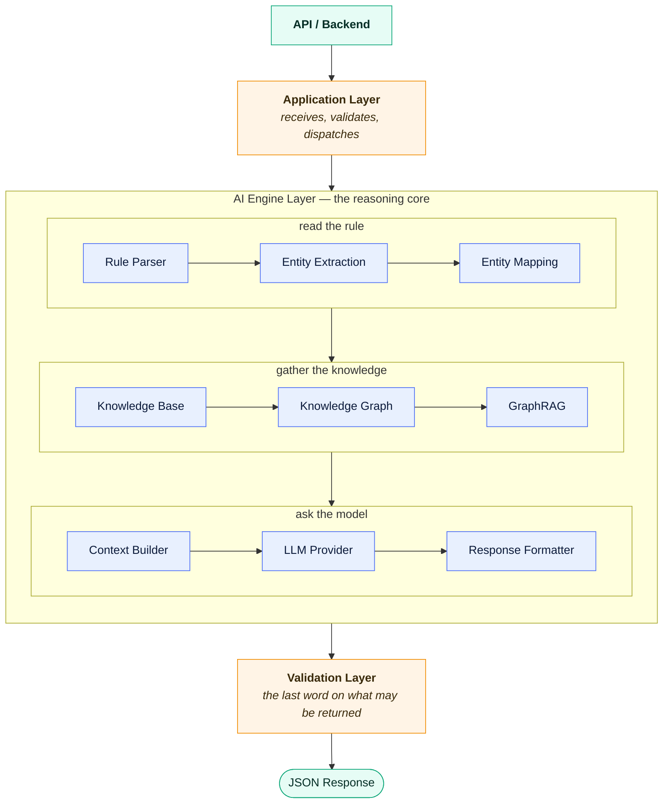
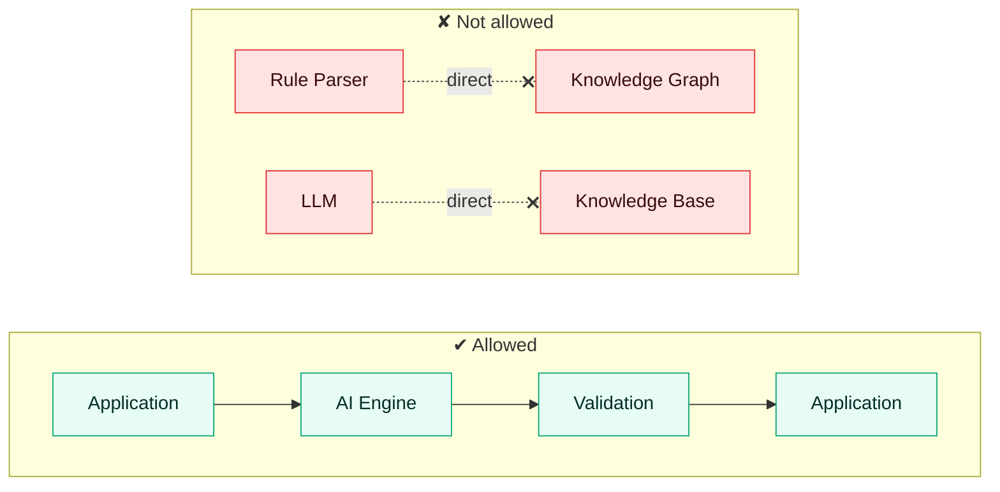

# AI Engine Architecture

**Version:** 1.0 · **Status:** Draft · **Stage:** 00 — Foundations

> [!NOTE]
> A design-stage document. For the architecture as built — including the HTTP service and the
> eight-stage pipeline — see the [project README](../../README.md).

---

## Overview

The ODOSIAN AI Engine follows a layered architecture to ensure modularity, maintainability,
scalability, and testability.

Each layer has a single responsibility and communicates only with adjacent layers.

---

## High-level architecture

---

## Layers

### 1 · Application layer

Receives requests, validates the request schema, invokes the AI engine, and returns the response.

**It never performs AI reasoning.**

### 2 · AI engine layer

The core business logic — the nine components in the diagram above.

### 3 · Validation layer

Validates the AI output: the JSON schema, the confidence, and any hallucination indicators. It
produces the final validated response, and it is what stands between a generated answer and a
caller acting on it.

---

## Module responsibilities

| Module | Responsibility |
| --- | --- |
| Rule Parser | Parse Elastic detection rules. |
| Entity Extraction | Extract techniques, fields, products, data sources, actors, commands, and the rest. |
| Entity Mapping | Map extracted entities to standardised knowledge. |
| Knowledge Base | Retrieve cybersecurity knowledge. |
| Knowledge Graph | Represent relationships between entities. |
| GraphRAG | Retrieve the most relevant graph context. |
| Context Builder | Build the final prompt context. |
| LLM Provider | Execute inference. |
| Response Formatter | Convert inference into structured JSON. |
| Validation | Validate the generated response. |

---

## Architecture principles

| Principle | |
| --- | --- |
| Layered architecture | Each layer talks only to its neighbours. |
| Loose coupling | Modules depend on interfaces, never on each other's implementations. |
| High cohesion | One responsibility per module. |
| Dependency injection | Collaborators are supplied, not constructed in place. |
| Provider independence | No layer learns which language model backend is behind it. |
| Config first | Behaviour is configured, not hard-coded. |
| Prompt as code | Prompts are versioned assets, reviewed like code. |
| Validation first | Nothing is returned that has not been validated. |

---

## Communication rules

كل Module يتواصل فقط عبر الواجهات (Interfaces) — لا يستدعي أي مديول تنفيذَ مديول آخر مباشرة.

*Every module communicates only through the interfaces. No module calls another module's
implementation directly.*

---

## Future expansion

The architecture supports:

- Multiple LLM providers
- Multiple knowledge sources
- Additional graph databases
- Local AI models
- Cloud AI models
