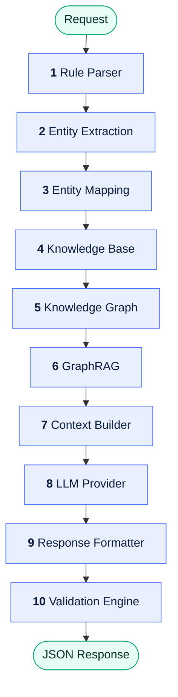
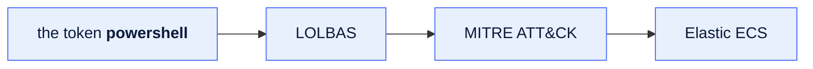
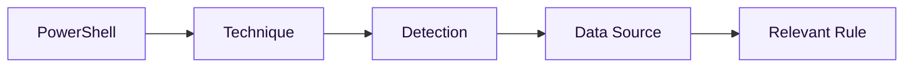

# Data Flow

**Version:** 1.0 · **Status:** Draft · **Stage:** 00 — Foundations

> [!NOTE]
> A design-stage document. The engine as built runs eight stages, with knowledge base, knowledge
> graph, and GraphRAG collapsed into one `retrieve` stage — see the
> [project README](../../README.md).

---

## Purpose

This document defines how data moves through the ODOSIAN AI Engine from the moment a request is
received until the final validated response is returned.

---

## Overview

Every step receives one contract and produces the next. Nothing skips ahead, and nothing reaches
back.

| Step | Stage | Receives | Produces |
| --- | --- | --- | --- |
| — | Request | rule text, operation type | Raw Request Object |
| 1 | Rule Parser | Raw Request Object | Structured Rule Object |
| 2 | Entity Extraction | Structured Rule Object | Extracted Entity List |
| 3 | Entity Mapping | Extracted Entity List | Mapped Entities |
| 4 | Knowledge Base | Mapped Entities | Knowledge Documents |
| 5 | Knowledge Graph | Mapped Entities | Knowledge Subgraph |
| 6 | GraphRAG | Knowledge Subgraph | Relevant Context |
| 7 | Context Builder | everything above | Final Prompt Context |
| 8 | LLM Provider | Final Prompt Context | Raw AI Response |
| 9 | Response Formatter | Raw AI Response | Structured Response |
| 10 | Validation Engine | Structured Response | Validated Response |

---

## Request

**Input**

- Rule text
- Operation type — one of `analyze`, `enhance`, `generate`

**Output** — Raw Request Object

---

## Step 1 — Rule Parser

Parses the rule, detects syntax errors, normalises it, and builds a structured object.

**Output** — Structured Rule Object

---

## Step 2 — Entity Extraction

Extracts cybersecurity entities from the parsed rule:

| | |
| --- | --- |
| MITRE techniques | Commands |
| Fields | File paths |
| Products | Registry keys |
| Data sources | Processes |
| Domains | IP addresses |

**Output** — Extracted Entity List

---

## Step 3 — Entity Mapping

Maps extracted entities to standardised identifiers.

**Output** — Mapped Entities

---

## Step 4 — Knowledge Base

Retrieves documentation and reference knowledge related to the mapped entities.

Sources may include MITRE ATT&CK, Sigma, Elastic, Atomic Red Team, LOLBAS, and internal knowledge.

**Output** — Knowledge Documents

---

## Step 5 — Knowledge Graph

Loads the relationships between entities.

**Output** — Knowledge Subgraph

---

## Step 6 — GraphRAG

Retrieves only the most relevant graph context — not everything reachable, only what earns its
place in the prompt.

**Output** — Relevant Context

---

## Step 7 — Context Builder

Merges the parsed rule, the extracted entities, the mapped entities, the knowledge documents, the
graph context, and the user's operation into one package.

**Output** — Final Prompt Context

---

## Step 8 — LLM Provider

Executes inference using the configured language model.

**Input** — Prompt Context · **Output** — Raw AI Response

---

## Step 9 — Response Formatter

Converts raw AI output into the project's JSON schema.

**Output** — Structured Response

---

## Step 10 — Validation Engine

Validates the JSON schema, the required fields, the confidence, the internal consistency, and any
unsupported claims.

**Output** — Validated Response

---

## Final output

The AI engine returns:

- Validated JSON
- Confidence score
- Reasoning
- Suggestions, when applicable
